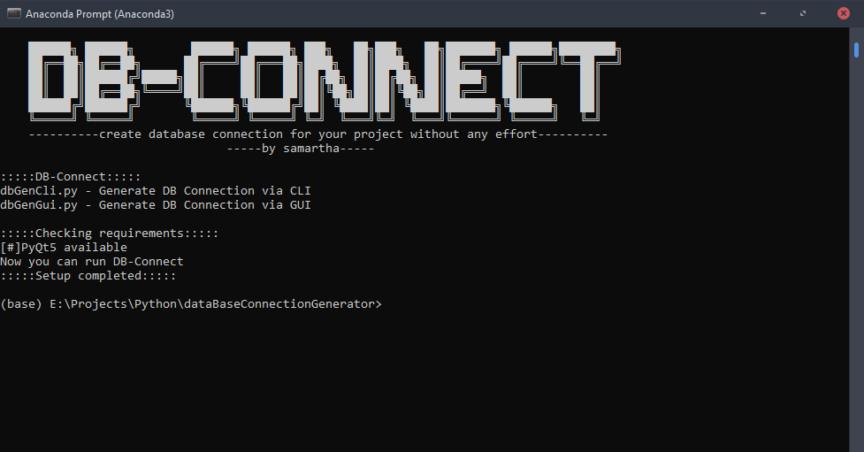

<a href=""></a>

# dataBaseConnectionGenerator
`stable build v1.1`
### DB-Connect
> Generate Database connection for your project with no effort

> Graphical User Interface for easy usage

[](https://github.com/yunghog/dataBaseConnectionGenerator)
[](https://github.com/yunghog/dataBaseConnectionGenerator)
[](https://github.com/yunghog/dataBaseConnectionGenerator)

## Table of Contents
- [Requirements](#requirements)
- [Installation](#installation)
- [Features](#features)
- [Usage](#usage)
- [ChangeLog](#changelog)
- [Snapshot](#snapshot)
- [Support](#support)
- [Contributing](#contributing)

## Requirements
> Python 3.x.x

>PyQt 5.x

### Installing PyQt5
- If you are using Anaconda then PyQt is already installed. If you have old version then you may need to update to PyQt5
- If PyQt is not installed then it can be installed using command
``` shell
pip install PyQt5

```

## Installation
- clone this repo into any directory using url : https://github.com/yunghog/w3bsite13locker.git
 ```shell
git clone https://github.com/yunghog/dataBaseConnectionGenerator.git
```
- open the cloned directory
- run `setup.py` using command
```pythonn
python setup.py
```
## Features
- Generate Database Connection file with no effort
- Graphical User Interface for easy usage
- Commandline script for quick operation
- Lightweight python script
- Easy to handle

## Usage
- To use the Commandline version of dbConnect, run `dbGenCli.py` using command
```python
python dbGenCli.py
```
- Then a prompt will ask to input DB variables. Input the variables and hit enter to generate DBConnection
- To use Graphical version of dbConnect, run 'dbGenGui.py' using command
```python
python dbGenGui.py
```
- Fill the fields and hit `generate` button to generate DBConnection
- Click on `preview` button to preview the code

## ChangeLog
```shell
  # dataBaseConnectionGenerator v1.0
  - generate dbConnection using cli script
  - graphical use interface for easy interaction
  - preview button to open the generated script instantly
  - raise exception for invalid input

  # dataBaseConnectionGenerator v1.1
    - added about window
    - dark theme for GUI
    - preview section format
```

## Snapshot
- `setup.py`


- `dbGenGui.py`


## Support
- This section will be updated soon

## Contributing
- 🍴 Fork this repo!
- 👯 Clone this repo to your local machine using `https://github.com/yunghog/dataBaseConnectionGenerator.git`
- Pull requests
